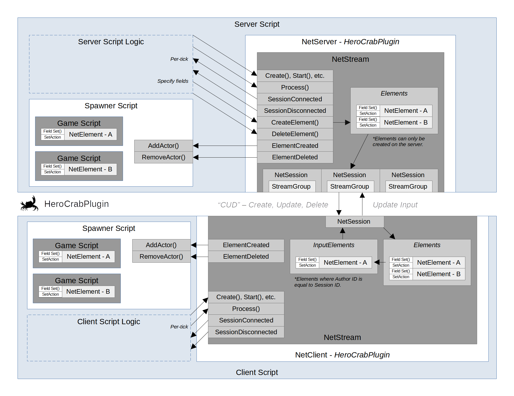

# HeroCrabPlugin

HeroCrabPlugin is an authoritative network messaging framework for use in multi-player games developed with [Flax Engine](https://flaxengine.com/). The framework is unit tested and designed to be simple, flexible, and modular. This README provides an introduction to the core components and general use-case examples.

## Components

| Class Name     | Description                                                                                                          |
|:-------------- |:-------------------------------------------------------------------------------------------------------------------- |
| NetConfig      | Configuration of host network parameters; retrieved from json.                                                       |
| NetSettings    | Network specific settings (tick rate, packet rate, buffer depth, etc.).                                              |
| NetBootStrap   | Static class for loading and/or storing network configuration.                                                       |
| NetServer      | Server implementation using the UDP sublayer.                                                                        |
| NetClient      | Client implementation using the UDP sublayer.                                                                        |
| NetStream      | A stream is a collection of Elements and Sessions.                                                                   |
| NetStreamGroup | A stream group is a bitmask for filtering elements from sessions.                                                    |
| NetElement     | An element contains fields and provides an RPC-like messaging tunnel. This is typically associated to a game script. |
| NetField       | A field is an RPC-end-point (example: byte, int, string, etc.).                                                      |
| NetSession     | A session uiniquely identifies the client connection sublayer.                                                       |
| NetSublayer    | Sublayer implementation for UDP.                                                                                     |

## Diagram



## Getting Started

### 1. Initialization

The first order of business is determining whether you will initialize the network configuration from .json or constructor. You can write a default configuration file using the following:

```
NetConfig.Write("client.json");
```

To initialize the boot strap configuration use the following:

```
if (NetBootStrap.Initialize(jsonFilePath)) {
        Debug.Log($"HeroCrabPlugin configuration .json found: {jsonFilePath}");
}
```

Another option is to use the constructor:

```
NetBootStrap.Config = new NetConfig(".01", serverAddress:"herocrab.com", 
    serverPort: 42000);
```

There are a number of optional arguments which can be used to specify other information. The default configuration is designed to incorporate three roles; a catalog server, game server, and game client over the _loopback_ address (127.0.0.1).

--

### 2. Server/Client Creation

The default network settings are listed below:

```
public NetSettings(NetRole netRole,
    TickRate gameTickRate = TickRate.Hz60,
    HostPps serverPps = HostPps.Hz30,
    HostPps clientPps = HostPps.Hz30,
    byte reliableBufferDepth = byte.MaxValue,
    ushort maxConnections = 160)
{
```

To create a server (or client) use the specified factory, provide a role, other network settings, and register for events. 

```
private void InitializeServer()
{
    var config = NetBootStrap.Config;
    var settings = new NetSettings(NetRole.Server, maxConnections: config.MaxConnections);

    Server = NetServer.Create(settings);
    Server.LogWrite += OnLogWrite;
    Server.Stream.SessionConnected += OnSessionConnected;
    Server.Stream.SessionDisconnected += OnSessionDisconnected;
    Server.Stream.ElementCreated += OnElementCreated;
    Server.Stream.ElementDeleted += OnElementDeleted;
}

private void OnSessionConnected (INetSession session)
{
    // Do something here
}

private void OnSessionDisconnected (INetSession session)
{
    // Do something here
}

private void OnElementCreated (INetElement element)
{
    // Do something here
}

private void OnElementDeleted (INetElement element)
{
    // Do something here
}
```

Be sure to unregister from events in the OnDestroy() method of your server and/or client scripts, or before re-assigning the server and/or client.

--

### 3. Host Processing

It is required that the game tick loop "pedal" host processing. The frequency of this loop must match what is specified in the network settings, default options are 60 or 30hz. This can be accomplished in the following way:

```
public override void OnFixedUpdate()
{
    Server.Process(Time.GameTime);
}
```

### 4. Starting the Server/Client

The following will start a game server listening on the locally specified interface (use localhost or 127.0.0.1) and port. A game client can be started in the same manner though when starting a client these arguments refer to the destination server address.

```
Server.Start(config.ServerAddress, config.ServerPort);
```

### 5. Elements

Once the server is started and a client connects to the server the **SessionConnected** event will be invoked. It is then typical to create a "writable" network element so that the client can send to the server. Elements can only be created on the server and only those where the **AuthorId** match the **session.Id** can be written to by a client. Additionally, elements are streamed to all clients unless they have a non-zero **Recipient** property.

Network elements are RPC-like messaging tunnels which comprise added fields (RPC end-points) and typically have 1:1 parity with game scripts. When creating an element you can do so it _immediately_ or in the _disabled state_. By creating an element in the disabled state you can then take advantage of the **ElementCreated** event on the server and the AssetId field of the element description to spawn a corresponding game prefab, gaining the possibility to use the **OnStart()** method in the instantiated prefab object's script.

The example below identifies how to spawn a player controller in a disabled state, specify the asset id (ActorId enum), author id, and set a single recipient.

```
private void OnSessionConnected(INetSession session)
{
    var playerController = Server.Stream.CreateElement("PlayerController",
        (uint)ActorDb.ActorId.PlayerController, session.Id, false);

    playerController.Filter.Recipient = session.Id;
    playerController.Filter.StreamGroup = NetStreamGroup.Default;
}
```

This example uses an "actor database" which maps ActorDb.ActorId enum (uint) values to prefabs through a dictionary in the editor.

The stream group is a bitmask set on both the session and element, it can be used to filter elements to a session for different scenes or visibility groups (Lobby or Loading vs. Game).

Using the above approach the **ElementCreated** event will be invoked on the server. Generally, from this point, the server would instantiate a prefab and add the object to the scene. A reference to the **Element** and **Stream** will need to be cached in the script for later use. For this caching one approach is to extend **Script** into **NetScript** and set Element and Server properties.

```
private void OnElementCreated(INetElement element)
{
    ActorDb.ActorId actorId;
    try {
        actorId = (ActorDb.ActorId) element.Description.AssetId;
    }
    catch {
        throw new InvalidCastException($"Asset id could not be cast to actor id.");
    }

    Prefab prefab;
    if (_actorDb.PrefabDb.ContainsKey(actorId)) {
        prefab = _actorDb.PrefabDb[actorId];
    }
    else {
        throw new IndexOutOfRangeException($"Asset id {actorId} not found in ActorDb.");
    }

    var stream = element.IsServer ? Server.Stream : null;

    // Parent set to null to delay spawning
    var actor = PrefabManager.SpawnPrefab(prefab, null); 
    actor.Name = element.Description.Name;

    // 1:1 relationship between element and script
    var script = actor.GetScript<NetScript>();
    script.Server = stream;
    script.Element = element;

    _actors.Add(element, actor);
    actor.Parent = Actor;
}
```

To delete an element call **.Delete()**, this will invoke ElementDeleted on the server (and eventually the client).

```
Element.Delete();
```

This example also tracks the spawned actor in an _actors dictionary which is used to remove all actors later.

```
private void OnElementDeleted(INetElement element)
{
    if (!_actors.ContainsKey(element)) {
        return;
    }

    var actor = _actors[element];
    actor.Parent = null;

    _actors.Remove(element);
    Destroy(actor);
}
```

After gaining an understanding of elements, there is a helpful property called **Sibling**. This property can cache a reference on the seerver to a separate element from this stream _or another stream_. This can be leveraged in various design patterns, for coupling different streams together (registration vs advertisement), or for using multiple elements per script. 

### 6. Fields

By creating elements in a disabled state and caching a reference to them in the script or _network script_ it is then possible to add fields in the **OnStart()** method before the element is streamed to clients. This cleans up element creation.

It is also possible to create custom logic in your network script to have specific methods for **OnClientStart()** or **OnServerStart()**. The below example accomplishes this in a single script by checking the **IsServer** property on the element before implementing logic, it demonstrates one-way transmission of a writeable element from the client to the server. 

When adding a field you can specify whether the field is to be delivered reliably or unreliably, this equates to the delivery method as well as differing field buffer lengths.

Once an element has been enabled, you can no longer add fields to it.

```
public override void OnStart()
{
    if (Element.IsServer) {
        Element.AddString("Name", true, OnNameReceived);
        Element.AddBytes("Direction", false, OnDirectionReceived);
        Element.AddByte("Attack", true, OnAttackReceived);        Element.Filter.StreamGroup = NetStreamGroup.Default;
        Element.Enabled = true;
    } else {
        _playerName = Element.GetString("Name");
        _direction = Element.GetBytes("Direction");
        _attack = Element.GetByte("Attack");
    }
}

private void OnNameReceived(string name)
{
    // Do something here
}

private void OnDirectionReceived(byte[] bytes)
{
    // Do something here
}

private void OnAttackReceived(byte byte)
{
    // Do something here
}
```

Below is an example of bi-directional communication within the same script used as a version checker.

```
public override void OnStart()
{
    if (Element.IsServer) {
        Element.AddString("Version", true, OnVersionReceived);
        _status = Element.AddString("Status", true, null);
        Element.Enabled = true;    
    } else {
        _version = Element.GetString("Version");
        Element.SetActionString("Status", OnStatusReceived);
    }
}

private void OnVersionReceived(string version)
{
    var config = NetBootStrap.Config;
    if (config.Version == version) {
        _status.Set("Version is matching!");
    }
}

private void OnStatusReceived(string status)
{
    // Update the UI with status message
}

private void SetVersion()
{
    _version.Set("1.0");
}
```

Fields can be added to elements with a provided callback, retrieved from elements by name to be used as a setter, or updated with a callback. This satisfies all uses cases in various client/server architectures.

```
//Typical server creats the field and provides a callback
Element.AddString("Test", true, OnCallBack);

// Typical client cachees the setter and sets the field (transmit)
var test = Element.GetString("Test");
test.Set("Test 1, 2, 3");

// Typical client sets a callback (receive)
Element.SetAction("Test", OnCallBack);
```

### 7. Filtering

To filter elements from streams there are two options. 

The first option is to set the **Recipient** of an **Element** to the session.Id of the intended target session. If the **Recipient** is zer, the **Element** will be sent to _all_ clients. 

The second option is to use the **Element.Filter.StreamGroup** property which is a bitmask of type **NetStreamGroup**. Setting this property on an element provides an efficient and capable means of filtering at a macro level. Below are the default options for setting the stream group and what it looks like to set this on the session.

```
public enum NetStreamGroup
{
    Default = 1,
    Lobby = 2,
    Load = 4,
    Game = 8,
    Conclude = 16,
    Team1 = 32,
    Team2 = 64,
    Team3 = 128,
    Team4 = 256,
    Custom1 = 512,
    Custom2 = 1024,
    Custom3 = 2048,
    Custom4 = 4096,
}
```

On the server:

```
private override void OnSessionConnected(INetSession session)
{
    session.StreamGroup = NetStreamGroup.Lobby;
    // Create the intended element in a disabled state
}
```

On the game object network script:

```
public override void OnStart()
{
    if (Element.IsServer) {
        Element.Filter.StreamGroup = NetStreamGroup.Lobby;
        Element.AddString("Message", true, OnMessageReceived);
        Element.Enabled = true;
    } else {
        _message = Element.GetString("Message");
    }
}

private void SendMessage(string message)
{
    _message.Set("Test 1, 2, 3!");
}
```

### 8. Advanced

There are many things not stated in this README. A few important mentions are:

* When a client session connects it will receive all elements for it's stream group.
* When a client session disconnects all elements authored by it are deleted.
* When a client session transitions to a new stream group all previous elements will have **ElementDeleted** invoked for them and they will continue to exist on the server.
* When an client connects it will receive existing elements for its stream group; those elements will have fields that will be _set_ with the last known field value.
* Only deltas are streamed, if there is no change in a field nothing is sent.
* Re-iterate: You cannot add fields to an element after it has been enabled once.

The simple components of streams, elements, fields and stream groups can be combined to create very capable, complex architectures. The game type and multiplayer design will infer the logic built around these components. It is possible to build multi-layer client-server architectures.

If you are in need of additional examples other than what is provided here check the unit or integration tests. If that does not suffice feel free to contact me, _HeroCrab_ on the Flax Engine discord.

### 9. Contributions

I consider myself to be between amateur and advanced though I don't code professionally for my vocation, there will surely be areas for improvement in this code base. If you have recommendations on improving the capability, performance, or unit/integration tests for this plugin please submit a PR and I will review, conributions are welcome.