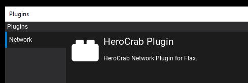

# HeroCrabPlugin


HeroCrabPlugin is a _plugin project_ that provides an authoritative network messaging framework for use in multi-player games developed with [Flax Engine](https://flaxengine.com/). It was designed to be simple, flexible, and modular with a primary use-case of distributed player-owned servers and centralized catalog server(s). This README provides an introduction to the core components and general API examples.

---

### Overview

* [Components](#components)
* [Diagram](#diagram)
* [Getting Started](#getting-started)
  - [Initialization](#initialization)
  - [Creation](#creation)
  - [Processing](#processing)
  - [Starting](#starting)
  - [Elements](#elements)
  - [Fields](#fields)
  - [Filtering](#filtering)
  - [Sessions](#sessions)
  - [Replays](#replays)
  - [Security](#security)
  - [Adding HeroCrabPlugin](#adding-herocrabplugin)
  - [Contributions](#contributions)
  - [Conclusion](#conclusion)

---

## <a name="components">Components</a>

| Class Name     | Description                                                                                                          |
|:-------------- |:-------------------------------------------------------------------------------------------------------------------- |
| NetConfig      | Configuration of host network parameters; retrieved by parsing command-line arguments.                               |
| NetSettings    | Network specific settings (tick rate, packet rate, buffer depth, etc.).                                              |
| NetBoot        | Static class for loading and/or storing network configuration.                                                       |
| NetServer      | Server implementation using the UDP sublayer.                                                                        |
| NetClient      | Client implementation using the UDP sublayer.                                                                        |
| NetStream      | A stream is a collection of Elements and Sessions.                                                                   |
| NetStreamGroup | A stream group is a bitmask for filtering elements from sessions.                                                    |
| NetElement     | An element contains fields and provides an RPC-like messaging tunnel. This is typically associated to a game script. |
| NetField       | A field is an RPC-end-point (example: bool, byte, int, string, float[], etc.).                                       |
| NetSession     | A session uniquely identifies the client connection sublayer.                                                        |
| NetSublayer    | Sublayer implementation for UDP; provides basic encryption.                                                          |
| NetReplay      | Client sublayer implementation for replay system.                                                                    |

## <a name="diagram">Diagram</a>


## Getting Started

### Initialization

Initialization of the NetConfig occurs through parsing of command-line arguments during game launch:

```
NetBoot.ParseCommandLine(Engine.CommandLine);
```

Or manually from a game script:

```
NetBoot.ParseCommandLine("name:HeroCrab_Server address:127.0.0.1 
    serverPort:12345 map:DemoMap);
```

Another option is to use the constructor:

```
NetBoot.Config = new NetConfig(address:"herocrab.com", serverPort: 42000);
```

There are a number of optional arguments which can be used to specify boot information. The default configuration is designed to incorporate three roles; a catalog server, game server, and game client communicating over the _loopback_ address (127.0.0.1). Domain names are supported.

| Optional command-line arguments | Type   |
|:------------------------------- |:------ |
| name:HeroCrab_Server            | string |
| role:server                     | string |
| address:127.0.0.1               | string |
| registerPort:42056              | ushort |
| catalogPort:42057               | ushort |
| serverPort:42058                | ushort |
| map:DemoMap                     | string |
| connections:200                 | ushort |
| log:1000                        | ushort |

If there are any issues parsing the command line, "help" context will be returned.

---

### <a name="creation">Creation</a>

The default network settings are listed below:

```
public NetSettings(TickRate gameTickRate = TickRate.Hz60,
    HostPps serverPps = HostPps.Hz30,
    HostPps clientPps = HostPps.Hz30,
    byte reliableBufferDepth = byte.MaxValue,
    ushort maxConnections = 100)
{
```

To create a server (or client) use the specified factory, provide network settings, and register for events. 

```
private void InitializeServer()
{
    var config = NetBoot.Config;
    var settings = new NetSettings(maxConnections: config.MaxConnections);

    Server = NetServer.Create(settings);
    Server.LogWrite += OnLogWrite;
    Server.Stream.SessionConnected += OnSessionConnected;
    Server.Stream.SessionDisconnected += OnSessionDisconnected;
    Server.Stream.ElementCreated += OnElementCreated;
    Server.Stream.ElementDeleted += OnElementDeleted;
}

private void OnSessionConnected (INetSession session)
{
    // Do something here
}

private void OnSessionDisconnected (INetSession session)
{
    // Do something here
}

private void OnElementCreated (INetElement element)
{
    // Do something here
}

private void OnElementDeleted (INetElement element)
{
    // Do something here
}
```

Ensure you unregister from events in the OnDestroy() method of your server and/or client scripts when destroying or before re-assigning the server and/or client.

---

### <a name="processing">Processing</a>

It is required that the game tick loop "pedal" host processing. The frequency of this loop must match what is specified in the network settings, default options are 60 (Flax default for FixedUpdate()) or 30hz (Flax default for Update()). This can be accomplished in the following way:

```
public override void OnFixedUpdate()
{
    Server?.Process(Time.GameTime);
}
```

--- 

### <a name="starting">Starting</a>

The following will start a game server listening on the specified interface (use localhost or 127.0.0.1) and port number. A game client can be started in the same manner though when starting a client arguments refer to the destination server address and port number.

```
Server.Start(config.ServerAddress, config.ServerPort);
```

---

### <a name="elements">Elements</a>

Once the server is started and a client connects to the server the **SessionConnected** event will be invoked. It is then feasible to create a "writable" network element so that the client can send to the server. Elements can only be created on the server and only those where the **AuthorId** match the **session.Id** can be written to by a client. Additionally, elements are streamed to all clients unless they have a non-zero **Recipient** property.

Network elements are RPC-like messaging tunnels which comprise added fields (RPC end-points) and typically have 1:1 parity with game scripts. When creating an element you can do so it _immediately_ or in the _disabled state_. By creating an element in the disabled state you can then take advantage of the **ElementCreated** event on the server and the AssetId field of the element description to spawn a corresponding game prefab, gaining the possibility to use the **OnStart()** method in the instantiated prefab object's script to declare fields.

The example below identifies how to spawn a player controller in a disabled state, specify the asset id (ActorId enum), author id, and set a single recipient.

```
private void OnSessionConnected(INetSession session)
{
    var playerController = Server.Stream.CreateElement("PlayerController",
        (uint)ActorDb.ActorId.PlayerController, session.Id, false);

    playerController.Filter.Recipient = session.Id;
    playerController.Filter.StreamGroup = NetStreamGroup.Default;
}
```

This example uses an "actor database" which maps ActorDb.ActorId enum (uint) values to prefabs through a dictionary populated in Flax editor.

The stream group is a bitmask set on both the session and element, it can be used to filter elements to a session for different scenes or visibility groups (Lobby or Loading vs. Game).

Using the above approach the **ElementCreated** event will be invoked on the server. Generally, from this point, the server would instantiate a prefab and add the object to the scene. A reference to the **Element** and **Stream** is useful to cache in the prefab script for later use. For this caching one approach is to extend **Script** and create a **NetScript** and then set Element and Server properties.

```
private void OnElementCreated(INetElement element)
{
    ActorDb.ActorId actorId;
    try {
        actorId = (ActorDb.ActorId) element.Description.AssetId;
    }
    catch {
        throw new InvalidCastException($"Asset id could not be cast to actor id.");
    }

    Prefab prefab;
    if (_actorDb.PrefabDb.ContainsKey(actorId)) {
        prefab = _actorDb.PrefabDb[actorId];
    }
    else {
        throw new IndexOutOfRangeException($"Asset id {actorId} not found in ActorDb.");
    }

    var stream = element.IsServer ? Server.Stream : null;

    // Parent set to null to delay spawning
    var actor = PrefabManager.SpawnPrefab(prefab, null); 
    actor.Name = element.Description.Name;

    // 1:1 relationship between element and script
    var script = actor.GetScript<NetScript>();
    script.Server = stream;
    script.Element = element;

    _actors.Add(element, actor);
    actor.Parent = Actor;
}
```

To delete an element call **.Delete()**, this will invoke ElementDeleted on the server (and eventually the client).

```
Element.Delete();
```

This example also tracks the spawned actor in an _actors dictionary which is used to remove all *network spawned* actors later.

```
private void OnElementDeleted(INetElement element)
{
    if (!_actors.ContainsKey(element)) {
        return;
    }

    var actor = _actors[element];
    actor.Parent = null;

    _actors.Remove(element);
    Destroy(actor);
}
```

After gaining an understanding of elements, there is one helpful property called **Sibling**. This property can be used to cache a reference on the server to a separate element from _this stream or another stream_. This can be leveraged in various design patterns, for coupling different streams together (registration and advertisement). A use case for this is that of a _player controller_. The _player controller_ can be an element which provides only user input, it can have a reference to a **sibling** element which is the player character. This way you can easily create player character elements that are streamed to all clients, while the _player controller_ is streamed to only a single, relevent client.

An additional feature has been added to help facilitate the attachment of custom classes to elements on the server. These attached classes are referred to as **meta** and are not streamed to a client. A use case for **meta** would be if a _player selection_ script wanted to spawn a _player controller_, it could create the controller with any necessary included state. This way data can be retrieved by the _player controller_ script when it initializes on the server. Below is an example from a project developed with HeroCrabPlugin:

```
private void SpawnPlayer()
        {
            var spawnTransform = _teamManager.GetSpawnTransform(_unitSelection.Team);

            var spawnMeta = new NetElementMeta();
            spawnMeta.Add(spawnTransform);
            spawnMeta.Add(_unitSelection);

            // Spawn the player unit in a deferred state
            var playerUnitElement = Server.CreateElement("PlayerUnit",
                (uint)_unitSelection.ActorId, 0, false,
                meta:spawnMeta, streamGroup: NetStreamGroup.Game);

            // Spawn the player controller in a deferred state
            var playerControllerElement = Server.CreateElement("PlayerController",
                (uint)ActorDb.ActorId.PlayerController,
                Element.Description.AuthorId, false, meta:spawnMeta, streamGroup: NetStreamGroup.Game);
            playerControllerElement.Filter.Recipient = Element.Description.AuthorId;
            playerControllerElement.Sibling = playerUnitElement;
```

The above example will attach "spawnMeta" game state to the player unit and player controller. This state will then be retrieved by the respective script on the server during Start() or initialization. Additionally, the player controller element has a cached reference to the player using the "Sibling" property. Coupling these together, any input received by the player controller script can be applied to the server player actor, and streamed (using the sibling element fields) to all clients.

---

### <a name="fields">Fields</a>

By creating elements in a disabled state and caching a reference to them in the script or _network script_ it is then possible to add fields in the **OnStart()** method before the element is streamed to clients. This cleans up element field creation and ensures that all RPC-like functionality is defined within a game script.

The below example differentiates the environment the script is running on by checking the **IsServer** property on the element before implementing logic, it demonstrates one-way transmission of a writeable element from the client to the server. It is also possible to create custom logic in your network script and have specific methods for **OnClientStart()** or **OnServerStart()** established in **OnStart()**.

When adding a field to an element you can specify whether the field is to be delivered reliably or unreliably, this equates to the delivery method as well as providing relevant field buffer depth. For analog or responsive (predicted) player movements use an unreliable field. For scene control, ui control, or other critical actions which must be invoked and rendered use reliable fields.

Once an element has been enabled, **you cannot add fields to it unless you first disable it** (Enabled = false) for at least one game tick. Once the element is re-enabled fields will be propagated to clients.

```
private INetField<string> _playerName;
private INetField<float[]> _direction;
private INetField<byte> _attack;

public override void OnStart()
{
    if (Element.IsServer) {
        Element.AddString("Name", true, OnNameReceived);
        Element.AddFloats("Direction", false, OnDirectionReceived);
        Element.AddByte("Attack", true, OnAttackReceived);        
        Element.Filter.StreamGroup = NetStreamGroup.Default;
        Element.Enabled = true;
    } else {
        _playerName = Element.GetString("Name");
        _direction = Element.GetFloats("Direction");
        _attack = Element.GetByte("Attack");
    }
}

private void OnNameReceived(string name)
{
    // Do something here
}

private void OnDirectionReceived(float[] vector)
{
    // Do something here
}

private void OnAttackReceived(byte byte)
{
    // Do something here
}
```

Below is an example of bi-directional communication within the same script. This script is used as a version checker.

```
private INetField<string> _status;

public override void OnStart()
{
    if (Element.IsServer) {
        Element.AddString("Version", true, OnVersionReceived);
        _status = Element.AddString("Status", true);
        Element.Enabled = true;    
    } else {
        _version = Element.GetString("Version");
        Element.SetActionString("Status", OnStatusReceived);
    }
}

private void OnVersionReceived(string version)
{
    var config = NetBootStrap.Config;
    if (config.Version == version) {
        _status.Set("Version is matching!");
    }
}

private void OnStatusReceived(string status)
{
    // Update the UI with status message
}

private void SetVersion()
{
    _version.Set("1.0");
}
```

Fields can be added to elements with a provided callback, retrieved from elements by name to be used as a setter, or updated with a callback (i.e "SetAction"). This satisfies all uses cases in various client/server architectures.

```
//Typical server creates the field and provides a callback
Element.AddString("Test", true, OnCallBack);

// Typical client caches the setter and sets the field (transmit)
var test = Element.GetString("Test");
test.Set("Test 1, 2, 3");

// Typical client sets a callback (receive)
Element.SetAction("Test", OnCallBack);
```

Using the .Set() method for setting a field, provided the Element is enabled and there is no StreamGroup filtering, will stream the update to all clients. This is desirable for things like analog input or vector based movement. However, depending on your multiplayer code design, you may wish to send only the most current value to a client upon it's joining. This is facilitated with **.SetLastValue()**. Using .SetLastValue() will update the field in the server element but will not send the value real-time, it will only be sent upon a new session being established -or- upon the change to the current Element's StreamGroup. This is great for multiplayer implementation where initial state is critical like joining the game, or changing from the Lobby, but after that the simulation may run with a level of desynchronization.

```
private INetField<byte[]> _positionField;

public override void OnStart()
{
    if (Element.IsServer) {
        _positionField = Element.AddBytes("Position", true);
        Element.Enabled = true;    
    } else {
        Element.SetActionBytes("Position", OnPositionReceived);
    }
}

public override void OnUpdate()
{
    // This will not be streamed, only sent once with the latest value
    _positionField?.SetLastValue(Actor.Transform.Translation);
}

private void OnPositionReceived(byte[] bytes)
{
    // Called once with the latest value.
    var position = new Vector3(bytes);
    // Do something here
}
```

---

### <a name="filtering">Filtering</a>

To filter elements from sessions there are two options. 

* The first option is to set the **Recipient** of an **Element** to the session.Id of the intended target session. If the **Recipient** is zero, the **Element** will be sent to _all_ clients. 

* The second option is to use the **Element.Filter.StreamGroup** property which is a bitmask of type **NetStreamGroup**. Setting this property on an element provides an efficient and capable means of filtering at a macro level. Below are the default options for setting the stream group and what it looks like to set this on the session.

```
public enum NetStreamGroup
{
    Default = 1,
    Lobby = 2,
    Load = 4,
    Select = 8,
    Game = 16,
    Conclude = 32,
    Team1 = 64,
    Team2 = 128,
    Team3 = 256,
    Team4 = 512,
    Custom1 = 1024,
    Custom2 = 2048,
    Custom3 = 4096,
    Custom4 = 8192,
}
```

On the server:

```
private override void OnSessionConnected(INetSession session)
{
    session.StreamGroup = NetStreamGroup.Lobby;
    // Create the intended element in a disabled state
}
```

On the game object network script:

```
public override void OnStart()
{
    if (Element.IsServer) {
        Element.Filter.StreamGroup = NetStreamGroup.Lobby;
        Element.AddString("Message", true, OnMessageReceived);
        Element.Enabled = true;
    } else {
        _message = Element.GetString("Message");
    }
}

private void SendMessage(string message)
{
    _message.Set("Test 1, 2, 3!");
}

private void OnMessageReceived(string message)
{
    Debug.Log($"Server recieved this message: {message}")
}
```

---

### <a name="sessions">Sessions</a>

There are a couple of important notes regarding sessions, these are:

- When a client session disconnects all elements authored by it are deleted.

- When a client session transitions to a new stream group all previous elements will have **ElementDeleted** invoked for them on the client yet they will continue to exist on the server. This allows for quickly changing scenes/levels/worlds.

- When a client connects it will receive existing elements for its assigned stream group post filtering; those elements will have fields *set* with the *last known* field value. This means all *players* will be populated with their current *positions*.

- Only deltas are streamed over a session, if there is no change in a field nothing is sent.

- Elements with both reliable and unreliable fields will always be streamed over a session reliably only *IF* there are reliable fields with changes (deltas) queued.

---

### <a name="replays">Replays</a>

HeroCrabPlugin includes a very basic replay system whereby the server stream can turn on recording and capture stream data. A client can then "replay" the stream locally.

In order to make use of this system game logic must be designed such that everything needed to accurately recreate a simulation is streamed to recipient "0" or _all recipients_. This will generally exclude input from clients and infers that required game input will be applied to separate game script/network elements for rendering world events or player actions/movements.

This system works through a stream **recorder** sublayer on the server which is set with a StreamGroup of _Record_ or "0" as a bitmask.

To start recording on a server:

```
    server.Stream.Recorder.Start(time);
```

To stop recording on the server:

```
    server.Stream.Recorder.Stop();
```

This basic stream capability does not _presently_ include a means to save replay data to file, perhaps in a future version. 

To access the replay data:

```
    var replayData = server.Stream.Recorder.Bytes;
```

Replaying a stream requires the creation of a special replay client. This is a client with no networking capability that unreels replay data and feeds it to the client stream. 

To create a replay client:

```
    var replay = NetReplay.Create();
    replay.Stream.ElementCreated += ElementCreated;
    replay.Play(Time.GameTime, replayData);
```

It is required to process the replay client _per-tick_ just like with other hosts:

```
    replay.Process(Time.GameTime);
```

To stop the replay client use:

```
    replay.Stop();
```

In terms of connecting the replay client to your game logic, it works in the same manner as the default client. The only required task is to register for the **ElementCreated** and **ElementDeleted** events. 

---

### <a name="security">Security</a>

HeroCrabPlugin was designed to provide a *reasonable* level of security given it's primary use case of developer or player-hosted servers and a catalog server (think Minecraft). 

Security features are as follows:

* **Authoritative Server:** Elements must be created on the server and the server grants write permission to them for a single session. Attempting to write to an element in which a session is not the author is not permitted. Attempting to write to bogus elements are also not permitted.

* **Rate Limiting:** Packet rates are limited based on network settings. Exceeding the packet rate +5 will result in a forced disconnect.

* **Cryptography:** By default sublayer communications between client and server are encrypted using XXTEA algorithm and pre-shared keys. XXTEA is a minimal compute based cryptographic algorithm that provides light privacy. Initially traffic is encrypted using a Key-encrypting key (KEK), which can be viewed and set in Sublayer.cs. Once a session connects and the session id is assigned, an additional Traffic-encrypting key (TEK) is established for the duration of the session. This key is sent directly from server to client using the KEK. This is a minimal approach to security and can trivially be compromised by decompiling the game binary executable, extracting the KEK and capturing the initial session establishment to decrypt the TEK. In this case an eavesdropper would be able to inject input from client to server. 

For games which require username/password login, persistent database storage, digital assets, and/or in-game purchases *do not* use the default method of encryption. For these cases you will need to implement another authentication and encryption scheme which offers more security, a starting point would be to write a class to facilitate secure key or token exchange and implement ICryptoModule.

---

### <a name="adding-herocrabplugin">Adding HeroCrabPlugin</a>

This plugin is considered a "plugin project," documentation for plugin projects can be found [here](https://docs.flaxengine.com/manual/scripting/plugins/plugin-project.html).

To add HeroCrabPlugin to your game complete the following:

1) Clone the repositority or download it to /your-game/Plugins/ directory.

2) Update your-game.flaxproj file as follows:

```
    "References": [
        {
            "Name": "$(EnginePath)/Flax.flaxproj"
        },
        {
            "Name": "$(ProjectPath)/Plugins/HeroCrabPlugin/HeroCrabPlugin.flaxproj"
        }
    ],
```

3. Add a refrence to <your-game>.Build.cs build script as follows:

```
    public override void Setup(BuildOptions options)
    {
        base.Setup(options);
        options.ScriptingAPI.IgnoreMissingDocumentationWarnings = true;
        options.PublicDependencies.Add("HeroCrabPlugin");
    }
```

4. Right click <your-game>.flaxproj and "Generate scripts project files."

5. Launch Flax Editor and ensure the plugin shows up under  Tools --> Plugins:



If you have any difficulties with this process visit the [Flax Engine](https://flaxengine.com/discord) discord.

---

### <a name="contributions">Contributions</a>

I consider myself to be  an amateur hobbyist developer, there are surely areas for improvement in this code base. If you have recommendations on improving the capability, performance, or testing please let me know or submit a PR and I will review--conributions are welcome and will be identified in CONTRIBUTORS.md!

---

### <a name="conclusion">Conclusion</a>

The simple components of streams, elements, fields and stream groups can be combined to create capable, complex architectures. The game type and multiplayer design will infer the logic built around these components. It is possible to build multi-layer client-server architectures.

If you are in need of additional examples other than what is provided here check the unit or integration tests. If that does not suffice feel free to contact me, *HeroCrab* on the [Flax Engine](https://flaxengine.com/discord) discord.

Hope this may be of service to you. 

-Jarmo "HeroCrab"
